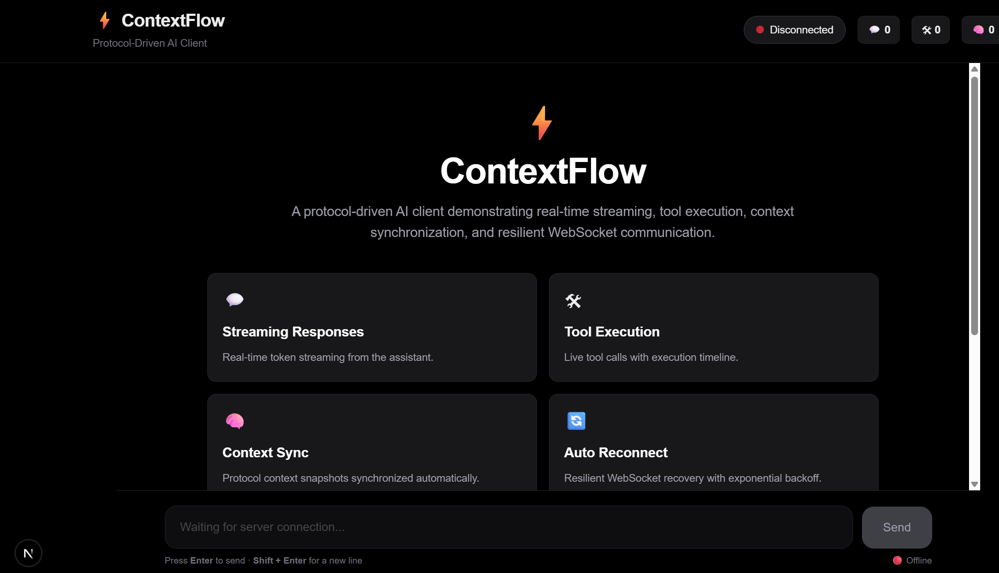
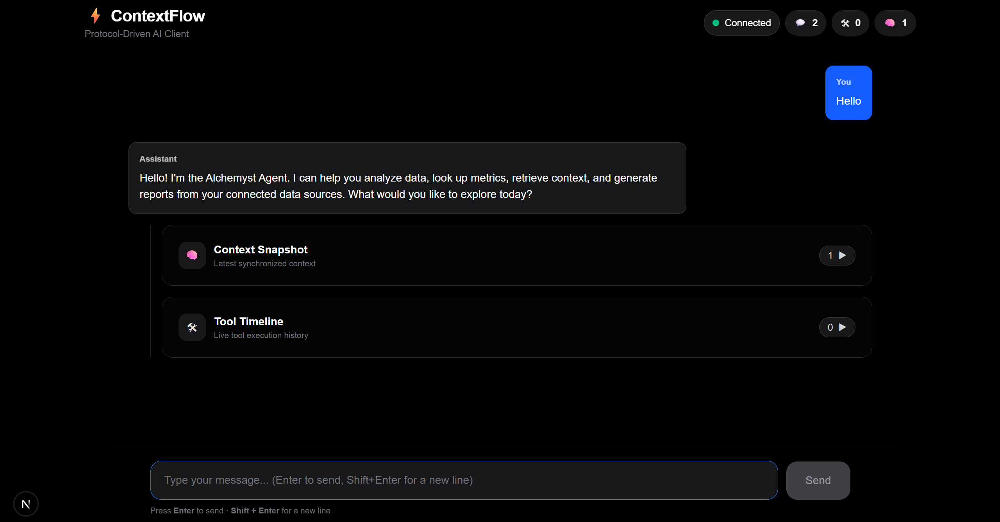
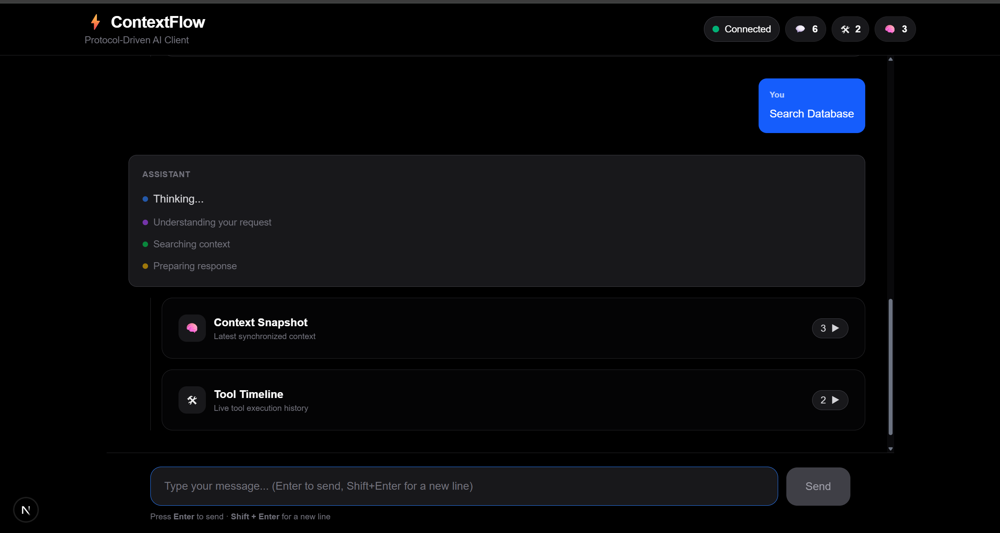
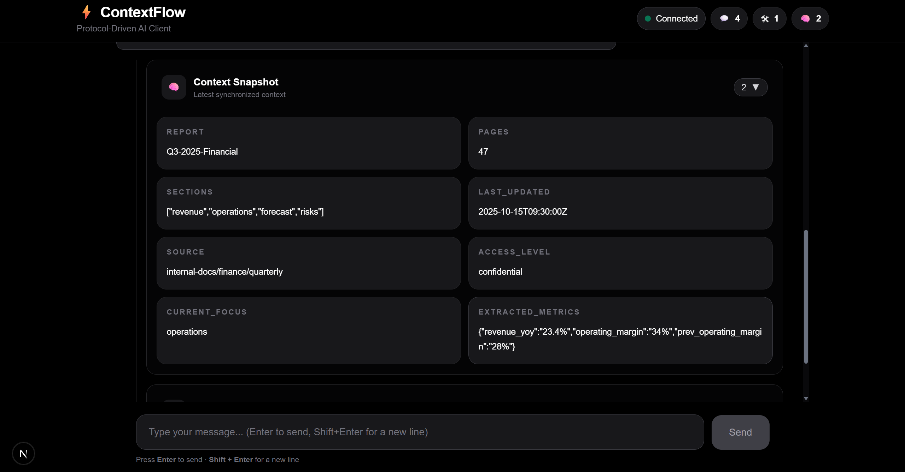
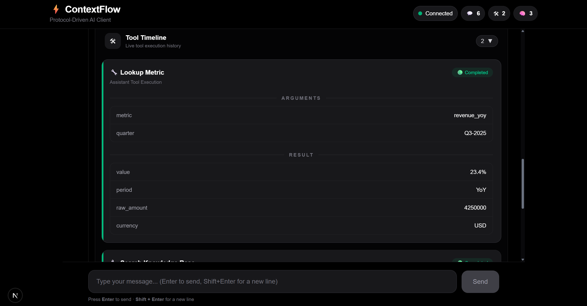
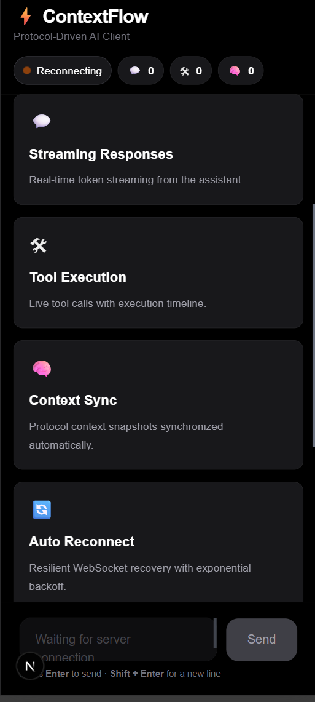

# ⚡ ContextFlow

> A protocol-driven AI client demonstrating real-time streaming, tool execution, context synchronization, and resilient WebSocket communication.


---

## 📖 Overview

ContextFlow is a modern AI client built around a custom protocol instead of traditional REST APIs.

The application demonstrates how enterprise AI assistants communicate using event-driven WebSocket messages while supporting:

- Real-time token streaming
- Tool execution lifecycle
- Context synchronization
- Automatic reconnection
- State persistence
- Responsive UI

Unlike a simple chatbot, ContextFlow visualizes every stage of the AI protocol.

---

# ✨ Features

## 💬 Streaming Responses

Assistant messages stream token-by-token in real time.

---

## 🔧 Tool Execution

Every tool invocation is displayed with:

- Arguments
- Running status
- Final result

---

## 🧠 Context Synchronization

Protocol context snapshots are synchronized independently from chat messages.

---

## 🔌 WebSocket Lifecycle

Supports

- Connecting
- Connected
- Reconnecting
- Disconnected

with automatic recovery.

---

## ♻ Auto Reconnect

Implements exponential backoff:

500ms

↓

1s

↓

2s

↓

4s

↓

8s

↓

10s

---

## 💾 Persistent State

Conversation history, tool executions, and context snapshots persist using Zustand Persist.

---

## 📱 Responsive Design

Optimized for

- Desktop
- Tablet
- Mobile

---

# 🏗 Architecture

```
                User
                  │
                  ▼
          React Components
                  │
                  ▼
           Zustand Store
                  │
                  ▼
         Protocol Runtime
                  │
                  ▼
      Connection Manager
                  │
                  ▼
            WebSocket
                  │
                  ▼
             AI Backend
```

---

# 🛠 Tech Stack

| Technology | Purpose |
|------------|----------|
| Next.js 15 | Frontend |
| React 19 | UI |
| TypeScript | Type Safety |
| Tailwind CSS | Styling |
| Zustand | State Management |
| WebSocket | Real-time Communication |
| Markdown | Assistant Rendering |

---

# 📂 Project Structure

```
ContextFlow
│
├── app/
├── components/
├── core/
│   ├── protocol/
│   ├── runtime/
│   ├── parser/
│   └── messages/
│
├── hooks/
├── lib/
├── store/
├── screenshots/
├── docs/
└── README.md

```

---

# 🚀 Getting Started

Install dependencies

```bash
npm install
```

Start development server

```bash
npm run dev
```

Run backend

```bash
npm run server
```

Open

```
http://localhost:3000
```

---

# 📡 Protocol Flow

```
User

↓

USER_MESSAGE

↓

Server

↓

TOKEN

↓

TOKEN

↓

TOKEN

↓

TOOL_CALL

↓

TOOL_RESULT

↓

CONTEXT_SNAPSHOT

↓

STREAM_END
```

---

# 🔄 Connection Lifecycle

```
Disconnected

↓

Connecting

↓

Connected

↓

Connection Lost

↓

Reconnecting

↓

Connected
```

---

# 📸 Screenshots

## Landing Page

Shows the application before a conversation begins.



---

## Chat

Real-time assistant responses with token streaming.




---

## Context Snapshot

Latest protocol context synchronized from the server.



---

## Tool Timeline

Visualizes tool calls, arguments, and execution results.



---

## Responsive Mobile Layout

Optimized interface for smaller screens.



# 📹 Demo

Watch the complete walkthrough

> A complete walkthrough video demonstrating architecture, protocol flow, streaming responses, context synchronization, and tool execution will be added soon.

---

# 📚 Documentation

Detailed documentation is available inside the **docs/** folder.

- Architecture
- Protocol
- State Management
- WebSocket
- UI
- Reconnection Strategy

---

# 👨‍💻 Author

**Md Aman**

GitHub:
https://github.com/Md-Aman45

LinkedIn:
https://www.linkedin.com/in/md-aman-7941a0355/

---

## License

This project is licensed under the MIT License.

See the LICENSE file for details.